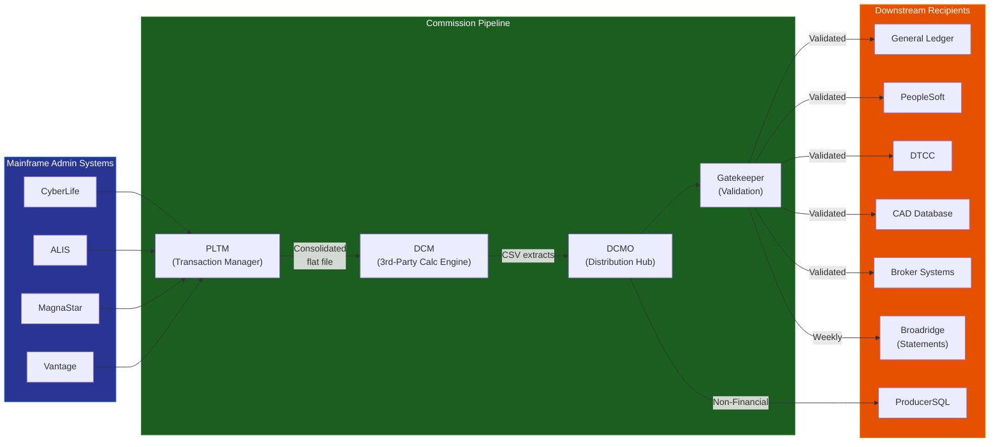
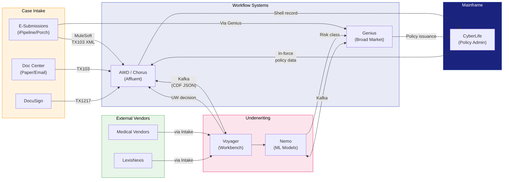

# Mainframe Systems Interaction Diagram

This diagram captures how Pacific Life's mainframe systems interact within the Life Division ecosystem — including policy admin systems, the Superset consolidation engine, downstream databases, external entities, and online/real-time systems.

---

## High-Level Mainframe Ecosystem

```mermaid
flowchart TB
    %% ===========================
    %% MAINFRAME SYSTEMS
    %% ===========================
    subgraph MAINFRAME["MAINFRAME (z/OS)"]
        direction TB
        subgraph ADMIN["Policy Administration Systems"]
            direction LR
            CL["CyberLife"]
            ALIS["ALIS"]
            MAG["MagnaStar<br/>(McCamish)"]
            VAN["Vantage"]
            IPAY["IPAY"]
            IAS["IAS"]
            SE2["SE2<br/>(Zinnia)"]
            MFAST["MFAST"]
        end
        SS["SUPERSET<br/>(COBOL Data Hub)"]
        VSAM["VSAM Files<br/>(Online Access)"]
        SQFILES["SQL Files<br/>(SQD101PD)"]
        TRIGGER["Trigger Files"]
        CFAD_EXT["CFAD Extracts<br/>(4 nightly files)"]
        PS_FILES["PS Accounting Files<br/>(SQ.SQD2001D)"]
    end

    %% ===========================
    %% ON-PREM DISTRIBUTED SYSTEMS
    %% ===========================
    subgraph ONPREM["ON-PREMISES (Distributed)"]
        direction TB
        SSQL["SuperSQL<br/>(SQL Server)<br/>~40 Policy Tables"]
        CFAD_DB["CFAD Database<br/>(Financial History)"]
        PS_DB["PS Accounting<br/>(CFAD_Super_SQL)"]
        PLTM["PLTM<br/>(Commission Ingestion)"]
        DCM["DCM<br/>(Commission Calc)"]
        DCMO["DCMO<br/>(Commission Distribution)"]
        PSQL["ProducerSQL<br/>(Agent/Producer Data)"]
        FILENET["FileNet<br/>(Document Store)"]
    end

    %% ===========================
    %% CLOUD & ANALYTICS
    %% ===========================
    subgraph CLOUD["CLOUD / ANALYTICS"]
        direction TB
        SF["Snowflake<br/>(CMD, LID, EDV)"]
        S3["AWS S3<br/>(Parquet Files)"]
    end

    %% ===========================
    %% ONLINE / REAL-TIME SYSTEMS
    %% ===========================
    subgraph ONLINE["ONLINE & REAL-TIME SYSTEMS"]
        direction TB
        AWD["AWD / Chorus<br/>(Affluent New Business)"]
        GENIUS["Genius<br/>(Broad Market NB/UW)"]
        VOYAGER["Composable / Voyager<br/>(Underwriting Workbench)"]
        PPT["PPT<br/>(Producer Portal)"]
        NAV["Navigator<br/>(Policy Servicing)"]
        MLA["MLA<br/>(My-Life App)"]
    end

    %% ===========================
    %% EXTERNAL ENTITIES
    %% ===========================
    subgraph EXTERNAL["EXTERNAL ENTITIES"]
        direction TB
        DTCC["DTCC<br/>(Commission Clearing)"]
        BROADRIDGE["Broadridge<br/>(Statements)"]
        REINS["Reinsurance<br/>Partners (5-6)"]
        FISERV["Fiserv<br/>(AML/OFAC)"]
        MEDVENDORS["Medical Vendors<br/>(ExamOne, MIB,<br/>Pyramid, CRL)"]
        LEXIS["LexisNexis<br/>(MVR/EIR)"]
        ESUB["iPipeline / Porch<br/>(E-Submissions)"]
        MCCAMISH_EXT["McCamish<br/>(3rd-Party Admin)"]
        SE2_EXT["SE2 / Zinnia<br/>(3rd-Party Admin)"]
    end

    %% ===========================
    %% MAINFRAME INTERNAL FLOWS
    %% ===========================
    ADMIN --> SS
    SS --> VSAM
    SS --> SQFILES
    SS --> TRIGGER
    CL --> CFAD_EXT
    MAG --> CFAD_EXT
    CL --> PS_FILES

    %% ===========================
    %% MAINFRAME → ON-PREM FLOWS
    %% ===========================
    SQFILES -->|"PowerCenter ETL<br/>(daily batch)"| SSQL
    TRIGGER -->|"signals readiness"| SSQL
    CFAD_EXT -->|"SQ Jobs → ETL"| CFAD_DB
    PS_FILES -->|"FTP → Informatica"| PS_DB
    ADMIN -->|"Commission feeds"| PLTM
    PLTM -->|"Flat file"| DCM
    DCM -->|"Financial/NF extracts"| DCMO

    %% ===========================
    %% ON-PREM INTERNAL FLOWS
    %% ===========================
    DCMO --> PSQL
    DCMO -->|"Nightly files"| DTCC
    DCMO -->|"Weekly statements"| BROADRIDGE
    SSQL -->|"Daily refresh"| SF
    SSQL -->|"Dedicated table"| GENIUS
    CFAD_DB -->|"LifeReporting"| SF

    %% ===========================
    %% CLOUD FLOWS
    %% ===========================
    SS -->|"Monthly (unpacked)"| S3
    S3 --> SF

    %% ===========================
    %% ONLINE SYSTEM INTERACTIONS
    %% ===========================
    CL <-->|"Shell records /<br/>Policy issuance"| AWD
    CL <-->|"Policy issuance"| GENIUS
    GENIUS <-->|"Kafka (Broad Nemo)"| VOYAGER
    AWD <-->|"Kafka (CDF JSON)"| VOYAGER
    SSQL --> PPT
    SSQL --> NAV
    SSQL --> MLA

    %% ===========================
    %% EXTERNAL INTERACTIONS
    %% ===========================
    ESUB -->|"MuleSoft → TX103"| AWD
    MEDVENDORS -->|"via Intake"| VOYAGER
    LEXIS -->|"via Intake"| VOYAGER
    SSQL --> FISERV
    SSQL --> REINS
    MCCAMISH_EXT -.->|"Operates as"| MAG
    SE2_EXT -.->|"Flat files"| SE2

    %% ===========================
    %% STYLING
    %% ===========================
    style MAINFRAME fill:#1a237e,stroke:#0d47a1,color:#fff
    style ADMIN fill:#283593,stroke:#1565c0,color:#fff
    style ONPREM fill:#1b5e20,stroke:#2e7d32,color:#fff
    style CLOUD fill:#e65100,stroke:#f57c00,color:#fff
    style ONLINE fill:#4a148c,stroke:#6a1b9a,color:#fff
    style EXTERNAL fill:#b71c1c,stroke:#c62828,color:#fff

    style SS fill:#ffd600,stroke:#f9a825,color:#000
    style SSQL fill:#76ff03,stroke:#64dd17,color:#000
    style SF fill:#ff6d00,stroke:#e65100,color:#000
    style CL fill:#448aff,stroke:#2962ff,color:#000
```

---

## Batch Cycle Timing Diagram

```mermaid
gantt
    title Nightly Batch Cycle (Approximate PST)
    dateFormat HH:mm
    axisFormat %H:%M

    section Admin Systems
    CyberLife daily cycle :a1, 17:00, 3h
    ALIS daily cycle :a2, 17:00, 2h
    MagnaStar daily cycle :a3, 17:00, 3h
    Vantage daily cycle :a4, 17:00, 2h

    section PLTM/Commissions
    PLTM Commission Processing :p1, 18:00, 4h

    section Superset
    Superset Consolidation :s1, 20:00, 2h
    SQL File Generation (SQD101PD) :s2, after s1, 1h
    Trigger File Created :milestone, after s2, 0h

    section CFAD
    CFAD SQ Formatting Jobs :c1, after s1, 1h
    CFAD ETL Load :c2, after c1, 1h

    section SuperSQL
    PowerCenter Download & Stage :sq1, 23:00, 2h
    Balance Control Validation :sq2, after sq1, 30min
    Production Flip :sq3, 01:30, 30min

    section Snowflake
    CMD/RSD Load :sf1, 00:30, 1h
    LID Load :sf2, after sq3, 1h

    section Downstream
    PPT/Navigator Available :milestone, after sq3, 0h
    ProducerSQL Load :d1, after sq3, 1h
    DCMO Distribution :d2, 22:00, 4h
```

---

## Commission Data Flow (Mainframe → Distribution)

---

## New Business & Underwriting – Mainframe Interaction

---

## Legend

| Color/Shape      | Meaning                         |
| ---------------- | ------------------------------- |
| Dark Blue        | Mainframe systems               |
| Green            | On-premises distributed systems |
| Orange           | Cloud/analytics (Snowflake, S3) |
| Purple           | Online/real-time systems        |
| Red              | External entities               |
| Yellow highlight | Critical system (Superset)      |
